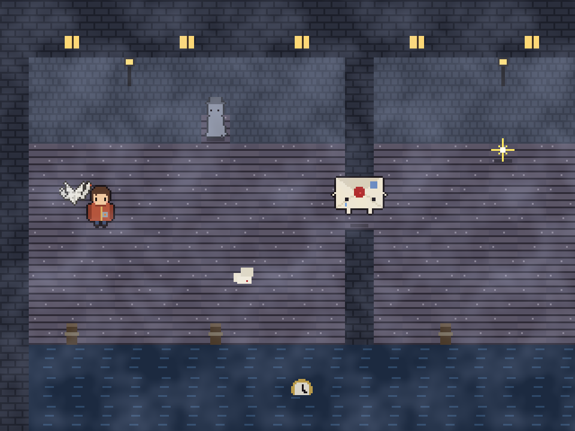
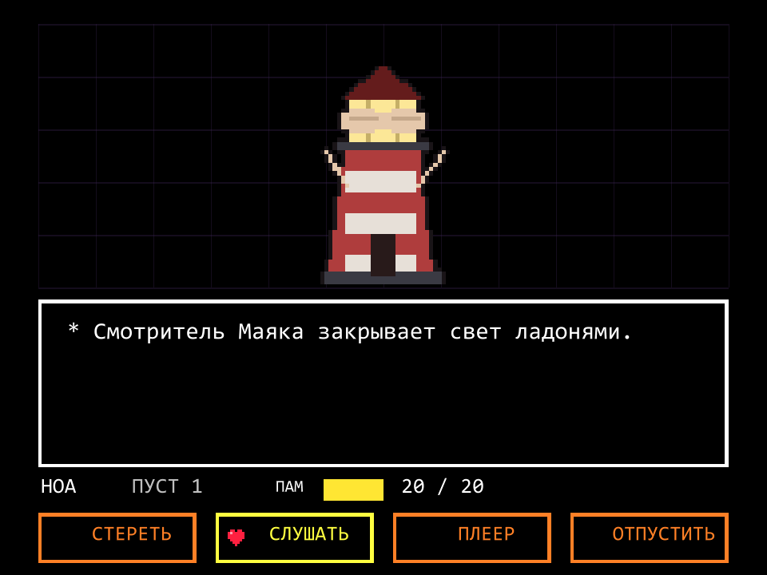
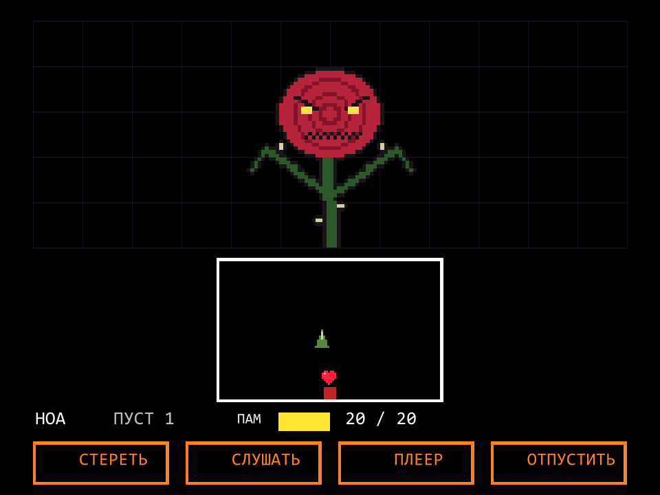
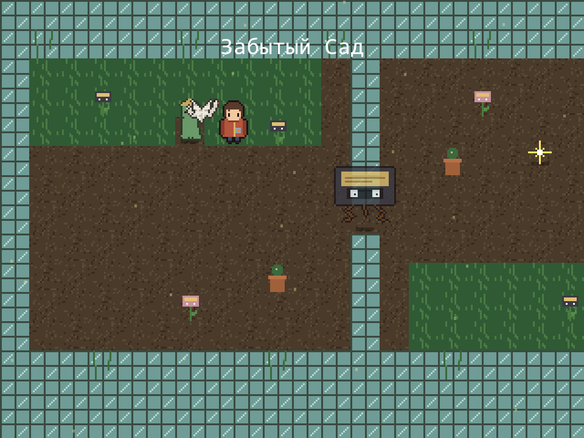
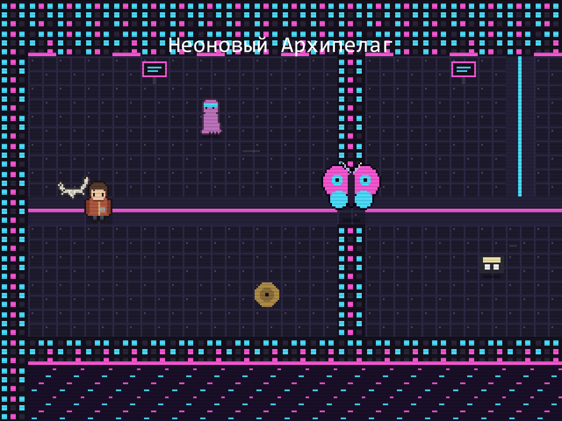
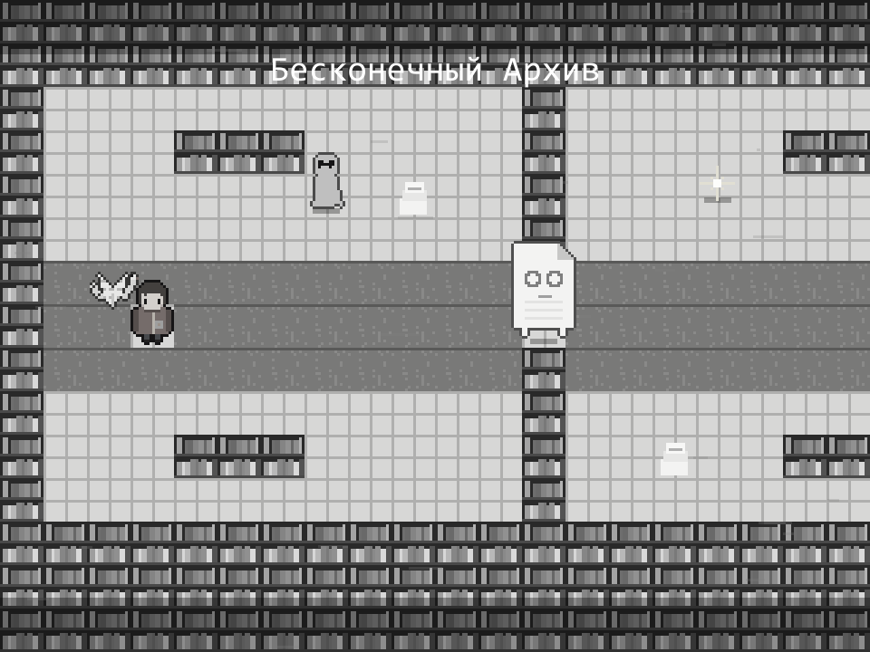

# Колыбельная для Эха · Lullaby of Echoes

Сюжетная RPG в духе Undertale о памяти, утрате и выборе между красивой иллюзией и настоящей жизнью.



Ноа просыпается в **Стигии** — закулисье человеческого разума, куда попадают забытые мысли, несбывшиеся надежды и угасшие чувства. Он помнит только своё имя, на нём слишком большая куртка, а в руках — выключенный плеер. Бумажный журавлик Скрип говорит, что домой можно вернуться через Бесконечный Архив. Мадам Эхо уверяет, что уходить незачем. А по пятам идёт безликая тень.

## Главная механика: выслушать или стереть

В боях ты никого не убиваешь. Каждого **Забытого** (осколок чьей-то травмы или брошенной мысли) можно:

- **ВЫСЛУШАТЬ** — узнать его историю, успокоить и отпустить;
- **СТЕРЕТЬ** — быстро победить и расчистить дорогу. Но с каждым стёртым мир становится серее, музыка — тише и тягучее, а Стигия запоминает всё.

| Меню боя | Уклонение |
|---|---|
|  |  |

## Что в игре

- **4 зоны**: Тихий Причал, Забытый Сад, Неоновый Архипелаг, Бесконечный Архив.
- **11 Забытых**, у каждого своя история, цепочка действий «Слушать» и свои атаки. Боссы — стадии горя: Отрицание, Гнев, Торг, Депрессия. Последний босс — трёхфазный: сначала тень, потом тьма, в которой видно только твоё сердце, потом сжимающиеся стены.
- **4 уровня сложности**: Новичок, Легко, Нормально, Трудно (подробнее ниже).
- **Кассеты для плеера** — обрывки реальной жизни Ноа, из которых складывается правда.
- **3 концовки**, и какая будет — зависит только от тебя.
- Игра замечает, как ты обращаешься с «ненужными» персонажами и диалогами.
- **Весь пиксель-арт и вся музыка генерируются кодом.** В проекте нет ни одной картинки или аудиофайла: спрайты рисуются процедурно, а чиптюн-синтезатор собирает саундтрек прямо в рантайме. Через все зоны проходит один лейтмотив — «Колыбельная».

| Забытый Сад | Неоновый Архипелаг | Путь Стирания |
|---|---|---|
|  |  |  |

## Управление

| Клавиша | Действие |
|---|---|
| Стрелки / WASD | ходить, выбирать |
| Z / Enter / Пробел | действие, дальше |
| X / Shift | промотать текст, назад. В бою удержание — медленное движение |
| C | статы |
| H | только на «Новичке»: мгновенно восстановить ПАМЯТЬ до максимума |

## Сложность

Выбирается при новой игре.

| | ПАМЯТЬ | Враги | Особенность |
|---|---|---|---|
| **Новичок** | 40 | слабые, редкие атаки | бесконечное восстановление: ПЛЕЕР → «Перемотать память (∞)» или клавиша **H** прямо во время уклонения. Пройдёт каждый |
| **Легко** | 30 | послабее | больше напевов-лечилок |
| **Нормально** | 20 | как задумано | боссы заставят попотеть |
| **Трудно** | 16 | больше здоровья, быстрые и плотные атаки | меньше неуязвимости после удара |

После каждого босса максимальная ПАМЯТЬ растёт на 4.

## Запуск

Нужен **Unity 6000.0.77f1** (Unity 6).

**Проще всего** — запустить `build_and_run.bat` в корне проекта. Он соберёт игру в папку `Build/` и сразу запустит её. Потом можно запускать через `run.bat`.

- Перед сборкой закрой проект в редакторе Unity: два экземпляра Unity не могут одновременно открыть один проект.
- Если Unity стоит не по стандартному пути, укажи его в переменной окружения:
  ```bat
  set UNITY_PATH=D:\Unity\6000.0.77f1\Editor\Unity.exe
  ```

**Через редактор**: добавь папку в Unity Hub и открой. Сцена `Assets/Scenes/Main.unity` и Build Settings создадутся автоматически. Жми Play. В верхнем меню **Lullaby** есть сборка под Windows и сброс сохранений.

> Если ты встретил серый экран после одной из концовок — так и задумано. Секрет: удерживай **Delete** 5 секунд. Или сбрось сохранения через меню **Lullaby**.

## Устройство проекта

Всё в `Assets/Scripts`. Игра не зависит от сцены: объект `Game` создаётся сам при старте.

| Файл | Что делает |
|---|---|
| `Game.cs` | корень игры, режимы, сохранения (PlayerPrefs), ввод, отрисовка через IMGUI в виртуальном экране 640×480, музыкальный плеер |
| `Synth.cs` | чиптюн-синтезатор: осцилляторы, ADSR, барабаны, эхо, аккомпанемент по гармонии |
| `Tracks.cs` | все треки и звуки: лейтмотив и его аранжировки по зонам, кассеты, SFX |
| `Pix.cs`, `Art.cs` | процедурный пиксель-арт: персонажи, Забытые, тайлы, эпилог; обесцвечивание мира |
| `World.cs` | карта, движение, коллизии, NPC, триггеры, компаньон, атмосферные эффекты |
| `Dialogue.cs` | окно диалога: печать по буквам, голоса, выбор ответа |
| `Battle.cs` | бой: меню, атака на тайминг, действия, пощада, уклонение и 13 паттернов снарядов |
| `Enemies.cs` | все Забытые: тексты, действия, атаки |
| `Story.cs` | карты зон, катсцены, кассеты, реакции на твой выбор, финал |
| `Screens.cs` | титульный экран, Game Over, концовки, титры |
| `AutoTest.cs` | бот-тестировщик (в обычной игре выключен) |
| `Editor/ProjectSetup.cs` | создание сцены, настройки плеера, сборка |

Чтобы заменить процедурную графику или музыку на нарисованную вручную, достаточно подменить ключ в `Art.Draw` или `Tracks.Get` — остальной код обращается к ним только по ключам.

### Автотест

Бот проходит игру сам и складывает скриншоты:

```bat
Build\LullabyOfEchoes.exe -autotest pacifist -shotdir shots -logFile test.log
```

Маршруты: `pacifist`, `erase`, `mixed`, а также `intro` и `scenes` для точечных проверок. Результаты в логе помечены `[AUTOTEST]`.
**Внимание:** автотест очищает сохранения игры.

## Авторы

- **Идея** — Антон
- **Разработал** — Лёха
